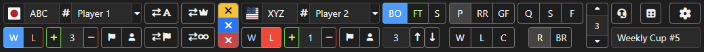
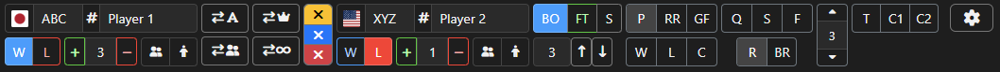
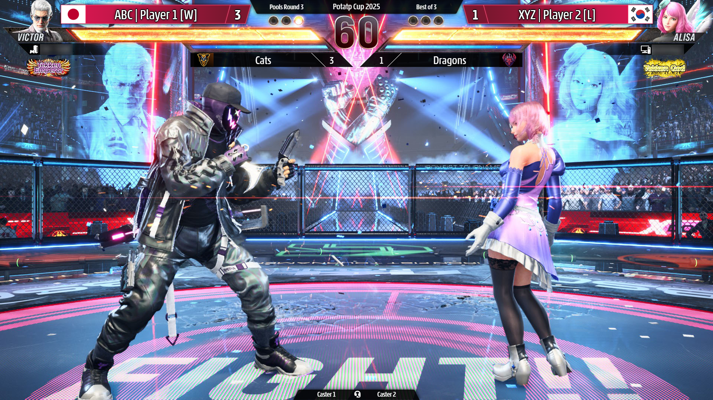
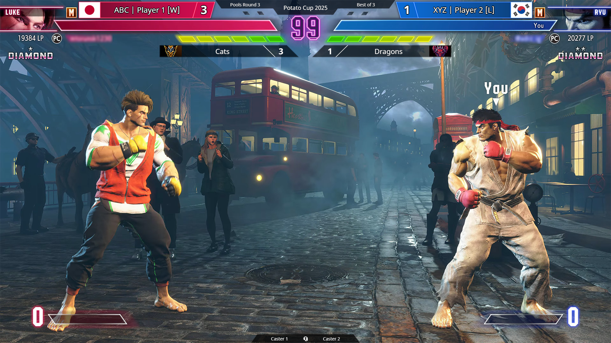
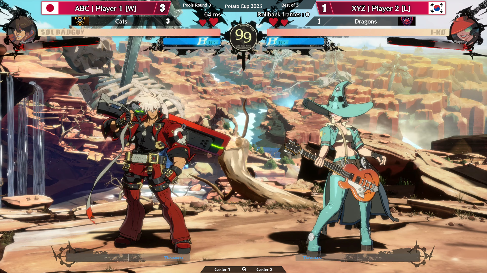
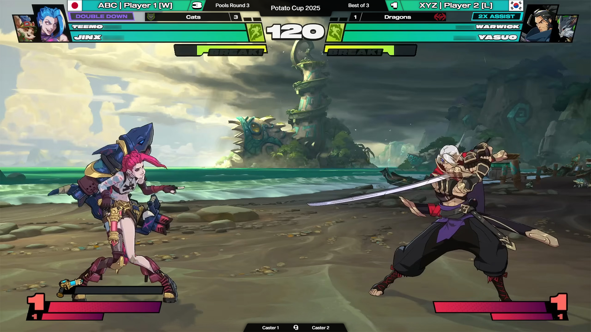

<h1 align="center">🥊🕹️🎥 FGCaster Overlay</h1>

A stream overlay app for software like OBS, designed for broadcasting fighting game matches and events.

## ❔ Why?

When looking at available options for fighting game stream overlay apps, I found that none of them were perfect enough for me, so I decided to make my own app instead! 😄 

Here is how it compares to the other fighting game-focused overlay apps out there:

FGCaster Overlay  | Other overlay apps
------------- | -------------
✔️ Covers all common FGC event use cases | ❌ Limited functionality
✔️ Easily customizable overlay templates | ❌ Difficult and\or limited customization options
✔️ Compact & embeddable controller UI | ❌ Sub-optimal UI
✔️ Only OBS required | ❌ Rely on additional software for backend
✔️ Free | ❌ Paid

## 🖥️ Features
### Controller

- Separate fields for player name, clan tag, score, in-game player ID, and "winners/losers" side display.
- Player character selectors that automatically load the correct character lists for the selected overlay template.
- Tag/team game support with up to 2 players per side and multi-character selection.
- Support for team names and scores (for example, for team battle events).
- Set a country flag or upload a custom image for any of the players or teams.
- Player and team presets (profiles) for easy and fast data entry on the go.
- Import lists of players directly from Challonge or Start.gg event pages.
- Presets for setting event stage, match type (can be set to custom values).
- Fields for up to 2 casters/commentators with their names and social media platforms' tags.
- Adjustable UI size to fit your specific setup and window layout.
- Switch between overlay templates on the fly.
- Helpful tooltips included 😉
### Overlay

- Dynamically changing overlay visuals based on available data.
- Comes with fully functional templates for several popular fighting games, such as:
	- Tekken 8
	- Street Fighter 6
	- Guilty Gear -Strive-
	- 2XKO
- Built-in templates include basic animations, which you can adjust or build upon if needed.
- Easy to edit or create your own templates using HTML, CSS, and JS.
- Just want to tweak the colors? Easy to do by editing CSS files, no coding knowledge required.
### 📋 Planned Features
- Localization support
- More pre-made templates
- And more...
### 💡 Have an idea for a new feature?
Submit your thoughts in the ["Issues"](https://github.com/LolJohn11/FGCasterOverlay/issues) tab!

## 🖼️ Overlay Examples
| Tekken 8  | Street Fighter 6 |
|:-------------:|:-------------:|
|  |  |

| Guilty Gear -Strive- | 2XKO |
|:-------------:|:-------------:|
|  |  |

## 📖 Check out the [Wiki](https://github.com/LolJohn11/FGCasterOverlay/wiki) for more information and tutorials!
