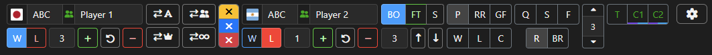

# 🥊🕹️🎥 FGCaster Overlay

A stream overlay app for software like OBS, designed for broadcasting fighting game matches and events.

## Why?

When looking at available options for fighting game stream overlay apps, I found that none of them were perfect enough for me, so I decided to make my own app instead! 😄 

Here is how it compares to the other fighting game-focused overlay apps out there:

FGCaster Overlay  | Other overlay apps
------------- | -------------
✔️ Covers all common FGC tournament use cases | ❌ Lack important functionality
✔️ Easily customizable overlay templates | ❌ Difficult and\or limited customization options
✔️ Compact & embeddable controller UI | ❌ Sub-optimal UI
✔️ Only OBS required | ❌ Rely on additional software for backend
✔️ Free | ❌ Paid

## Features
### Controller

* Separate fields for player name, clan tag, score, in-game player ID, and "winners/losers" side display.
* Player character selectors that automatically load the correct character lists for the selected overlay template.
* Support for team names and scores (for example, for team battle events).
* Set a country flag or upload a custom image for any of the players or teams.
* Presets for setting event stage, match type (can be set to custom values).
* Fields for up to 2 casters/commentators with their names, Twitch, and X tags.
* Adjustable UI size to fit your specific setup and window layout.
* Switch between overlay templates on the fly.
* Helpful tooltips included 😉
### Overlay

* Dynamically changing overlay visuals based on available data.
* Comes with fully functional templates for several popular fighting games, such as:
	* Tekken 8
	* Street Fighter 6
	* Guilty Gear -Strive-
* Built-in templates include basic animations, which you can adjust or build upon if needed.
* Easy to edit or create your own templates using HTML, CSS, and JS.
	* Includes "EzColor" template for fast customization if you just want to tweak the colors.
### Have an idea for a new feature?
Submit your thoughts in the "Issues" tab!

## Screenshots
| Tekken 8  | Street Fighter 6 | Guilty Gear -Strive- |
| ------------- |:-------------:|:-------------:|
|  |  |  |

## How to use
1. Download the `.zip` file of the [latest release](https://github.com/LolJohn11/FGCasterOverlay/releases/latest) version and extract the contents into any folder of your choosing.
2. Launch the `FGCaster-Overlay.exe`.
3. In your streaming software, add the controller UI as a custom browser dock. In OBS, you can do it by going to `Docks -> Custom Browser Docks` menu and adding a new dock with the URL `http://localhost:8008/`.

4. Add the overlay as a browser source to your scene. Set the URL to `http://localhost:8008/scoreboard` and match the size of the source to the size of the template (1920x1080 by default).
5. (Optional) If you ever need to change the port that this app will use from the default `8008` port, you can do that by changing the `port` value inside the `data.json`, found in the app's root folder.

## How to make new templates
Simply copy an existing template folder and rename it as desired to get started. All templates live in the `templates` folder and have the same file and folder structure inside. The file and folder names in your template folder must follow this schema:
```
📁template_name
├── 📁fonts
├── 📁img
├── 📄template.html
└── 📄template.css
```
The files in the `img` and `fonts` folders can be named however you like (just don't forget to change the references to said files in the `template.html` and `template.css`.
Once you have your new template files and folders set up and ready, you can modify the template using HTML, CSS, and JavaScript to achieve the desired look and functionality.
